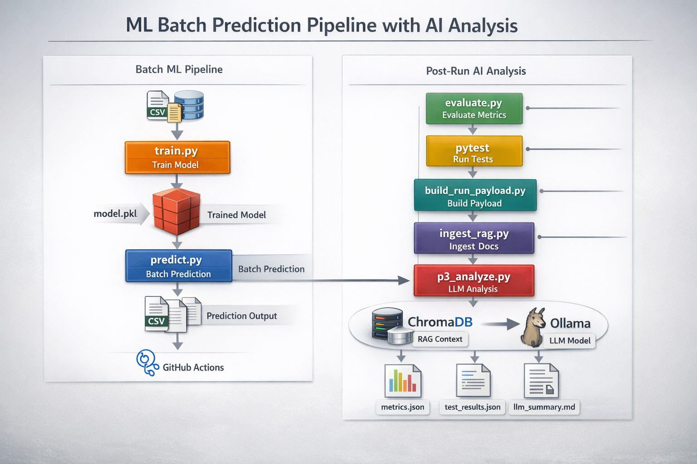
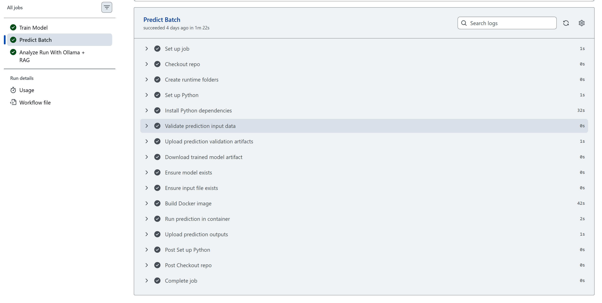
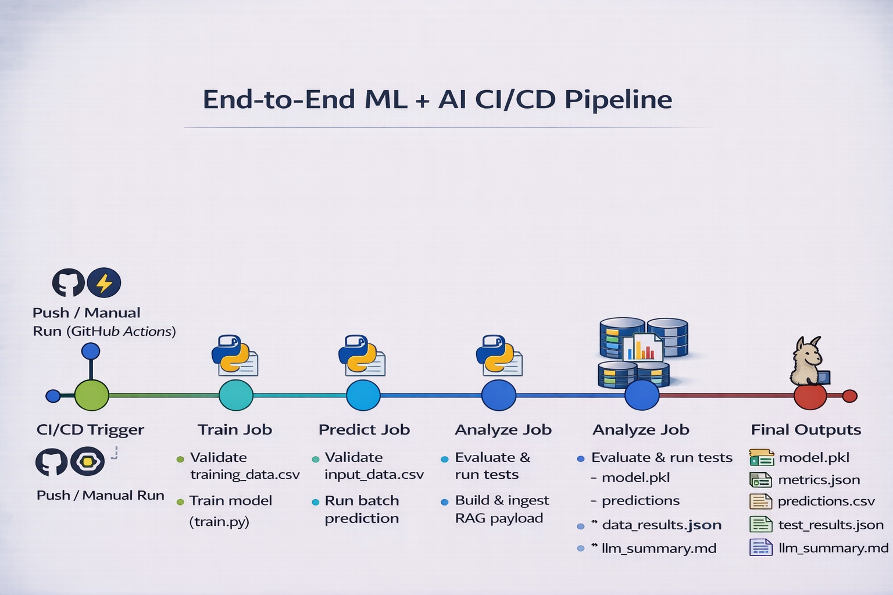
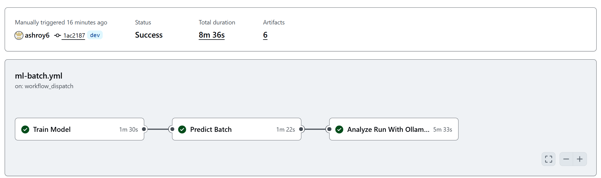
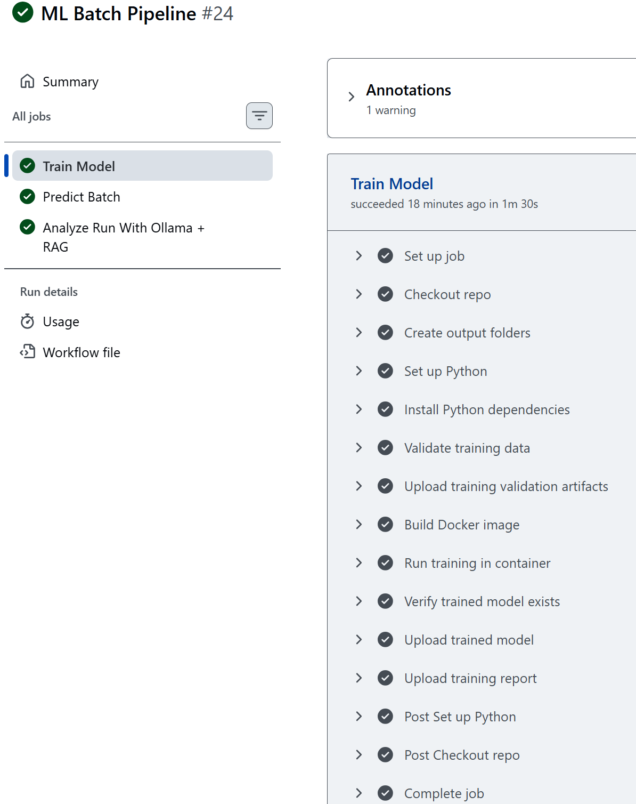
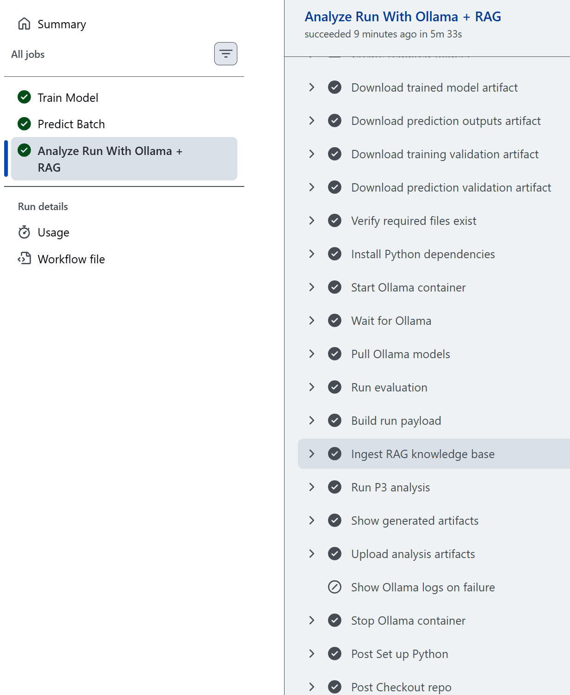
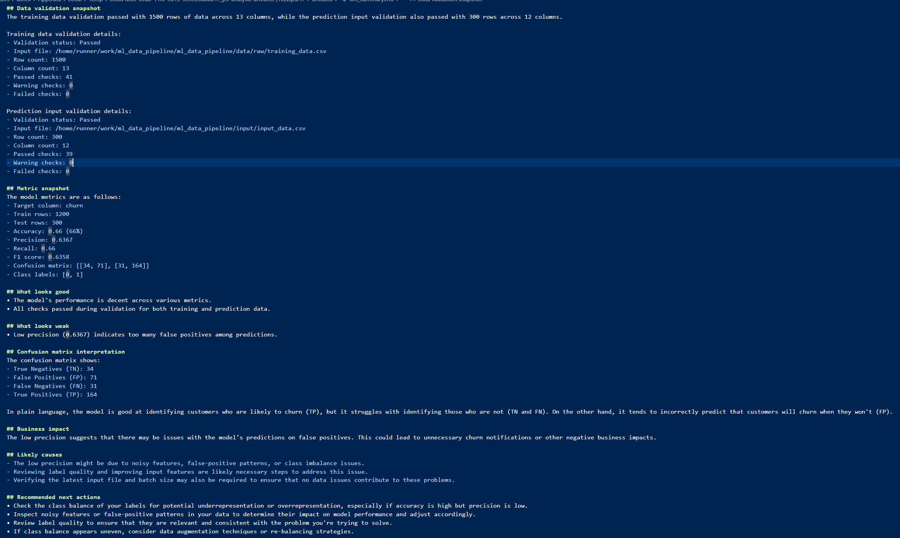

# ML Batch Prediction Pipeline with AI Analysis

Built an end-to-end batch ML pipeline using Python, scikit-learn, Docker, Docker Compose, and GitHub Actions, extended with automated evaluation, real pytest-based validation, input data validation, and AI-powered post-run analysis using Ollama and ChromaDB RAG.

A portfolio project that combines a production-style batch machine learning pipeline with post-run AI analysis and a data quality gate at the start of the workflow.

This project trains a churn prediction model, validates incoming CSV data before processing, performs batch inference on new input data, evaluates model performance, runs automated tests, and generates an AI-written analysis report using Ollama and ChromaDB-based RAG.

---

## Architecture Diagram









## Why this project matters

Most beginner ML projects stop at model training.

This project goes further and shows the surrounding engineering work that companies actually do:

- batch ML pipeline design
- model persistence and reuse
- Docker-based execution
- multi-container local setup with Docker Compose
- GitHub Actions CI/CD automation
- structured evaluation artifacts
- real pytest-based validation
- input data validation before train and predict
- AI-assisted post-run analysis
- local RAG pipeline using Ollama + ChromaDB
- branch-based safe development and iterative debugging

---

## What it does

### P1 capabilities
- trains a churn prediction model from historical labeled CSV data
- saves the trained model as a reusable artifact
- loads new batch input data
- generates predictions in batch mode
- saves prediction outputs and logs

### New validation layer
- validates `training_data.csv` before training
- validates `input_data.csv` before prediction
- checks schema, required columns, numeric fields, nulls, duplicates, and target values
- fails fast on critical data quality issues
- writes machine-readable and human-readable validation reports

### P3 capabilities
- evaluates model performance on the held-out test split
- creates structured metrics artifacts
- runs real pytest tests and exports machine-readable test results
- builds a local vector store from project knowledge files
- retrieves relevant RAG context for analysis
- uses Ollama to generate a human-readable summary of the run
- includes data validation results in the final AI summary
- packages all outputs into final analysis artifacts

---

## Data Stack

### Files

#### 1. `training_data.csv`
- 1500 labeled rows
- used to train and test a churn prediction model
- target column: `churn`
  - `1` = churned
  - `0` = retained

#### 2. `input_data.csv`
- 300 unlabeled rows
- used as new incoming batch data for inference
- this file does not contain the `churn` column because the model should predict it

---

### Columns

#### Training data columns
- `customer_id`: unique customer identifier
- `age`: customer age
- `monthly_spend`: current recurring spend
- `tenure_months`: months as a customer
- `support_tickets`: number of support tickets raised
- `last_login_days`: days since last login
- `contract_type`: Monthly, Quarterly, or Annual
- `payment_method`: Card, Bank Transfer, UPI, or Wallet
- `region`: customer region
- `num_products`: number of subscribed products
- `discount_used`: `1` if discount applied, else `0`
- `avg_session_minutes`: average session length
- `churn`: target label

#### Prediction input columns
- same as above except without `churn`

---

### Suggested local folders

- `data/raw/training_data.csv`
- `input/input_data.csv`

---

## Data validation layer

The pipeline now validates data before model execution begins.

### Training validation checks
- file exists and is not empty
- CSV parses correctly
- required training columns exist
- `churn` target exists
- numeric columns are numeric-compatible
- mandatory columns are not null
- duplicate rows are checked
- duplicate `customer_id` values are checked
- target values are limited to allowed values

### Prediction validation checks
- file exists and is not empty
- CSV parses correctly
- required prediction columns exist
- numeric columns are numeric-compatible
- mandatory columns are not null
- duplicate rows are checked
- duplicate `customer_id` values are checked

### Validation outputs
- `artifacts/data_validation_train.json`
- `artifacts/data_validation_train.md`
- `artifacts/data_validation_predict.json`
- `artifacts/data_validation_predict.md`

---

## Tech stack

- Python
- pandas
- scikit-learn
- joblib
- pytest
- pytest-json-report
- Docker
- Docker Compose
- GitHub Actions
- Ollama
- ChromaDB

---

## End-to-end flow

```text
training_data.csv
    ↓
validate_input.py --mode train
    ↓
data_validation_train.json + data_validation_train.md
    ↓
train.py
    ↓
model.pkl
    ↓
input_data.csv
    ↓
validate_input.py --mode predict
    ↓
data_validation_predict.json + data_validation_predict.md
    ↓
predict.py
    ↓
predictions output
    ↓
evaluate.py
    ↓
metrics.json + predictions_summary.json
    ↓
pytest + ingest_rag.py + p3_analyze.py
    ↓
test_results.json + llm_summary.md + llm_summary.json
    ↓
build_run_payload.py
    ↓
run_payload.json

```

## Container architecture

This project now uses a split container design for local AI analysis.

### App container

Runs the Python project code:

- validation
- training
- prediction
- evaluation
- RAG ingestion
- AI analysis

### Ollama container

Runs the LLM and embedding models:

- `llama3.2:3b`
- `nomic-embed-text`

### Compose files

- `Dockerfile` builds the app image
- `docker-compose.yml` orchestrates local multi-container execution
- `docker-compose.ci.yml` applies CI-specific override settings


---

## Key outputs

After a successful run, the pipeline produces:

- `models/model.pkl`  
  trained model artifact

- `artifacts/data_validation_train.json`  
  machine-readable training data validation report

- `artifacts/data_validation_train.md`  
  human-readable training data validation report

- `artifacts/data_validation_predict.json`  
  machine-readable prediction input validation report

- `artifacts/data_validation_predict.md`  
  human-readable prediction input validation report

- `artifacts/metrics.json`  
  structured evaluation metrics

- `artifacts/predictions_summary.json`  
  summary of the latest prediction batch

- `artifacts/test_results.json`  
  real pytest JSON report

- `artifacts/llm_summary.md`  
  human-readable AI analysis including validation, test, and metric context

- `artifacts/llm_summary.json`  
  machine-readable LLM output with context, prompt details, and validation snapshots

- `artifacts/run_payload.json`  
  final combined payload for downstream review

---

## Example engineering value

It shows:

- repeatable ML execution
- containerized pipeline stages
- multi-container LLM integration
- branch-based safe development
- CI/CD integration
- data quality validation before execution
- metrics consistency checks
- real test-report generation
- AI-generated operational summaries
- artifact-driven reporting

---

## What I built and debugged

During development, the project required fixing real pipeline issues, including:

- inconsistent evaluation logic between training and evaluation
- missing files in GitHub Actions branches
- broken dependency installation in Docker
- placeholder test result artifacts replaced with real pytest output
- missing LLM summary generation in CI
- incorrect prediction summary column detection
- RAG retrieval integration issues
- metric interpretation errors in generated summaries
- schema mismatch between validation rules and real CSV headers
- workflow naming issues in GitHub Actions manual runs
- Ollama container networking differences between local and CI execution

---

## GitHub Actions workflow

The GitHub Actions ML pipeline includes three jobs:

### Train

- installs dependencies
- validates training data
- uploads training validation reports
- builds the Docker image
- trains the model
- uploads the trained model artifact

### Predict

- installs dependencies
- validates prediction input data
- uploads prediction validation reports
- downloads the trained model
- runs batch prediction
- uploads prediction outputs and logs

### Analyze

- downloads trained model and prediction outputs
- starts Ollama in a container
- pulls LLM and embedding models
- evaluates the model
- runs pytest and exports the test report
- ingests the RAG knowledge base
- generates the AI summary including validation results
- uploads analysis artifacts

## Results and Screeshots







